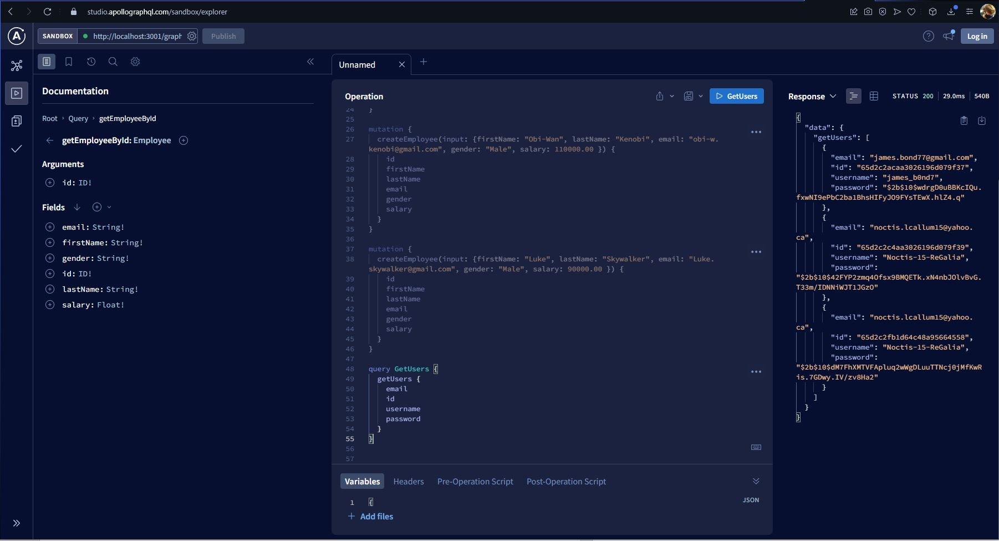
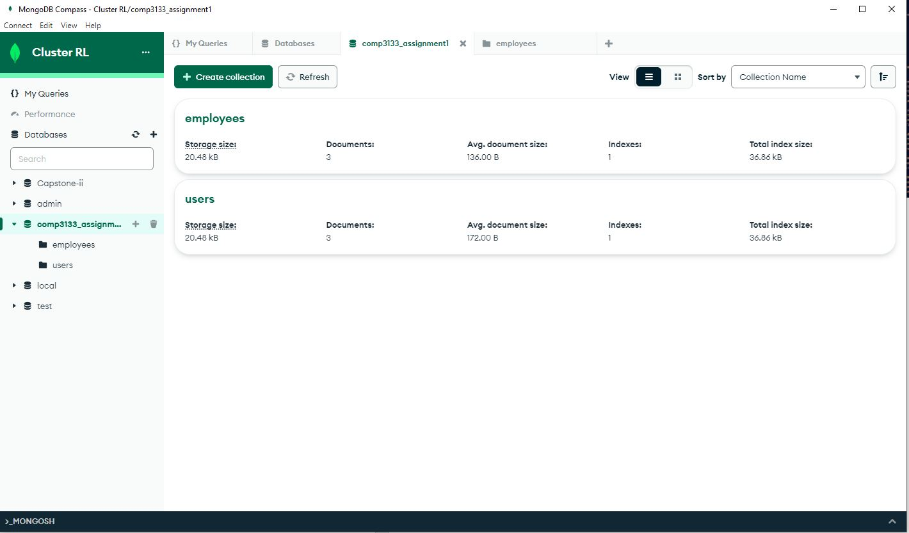
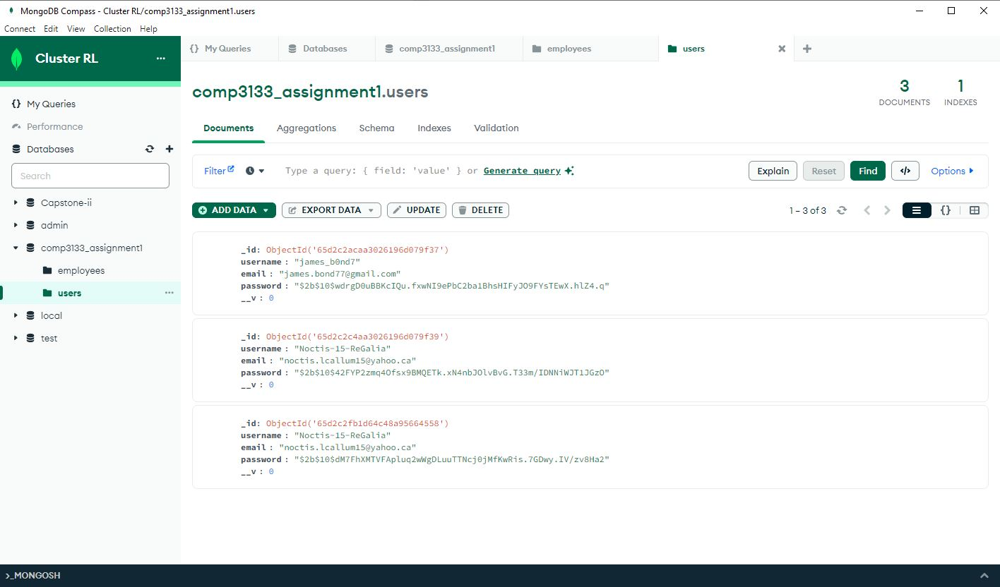
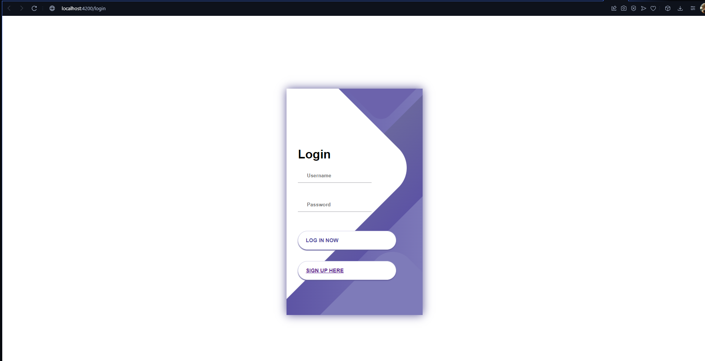
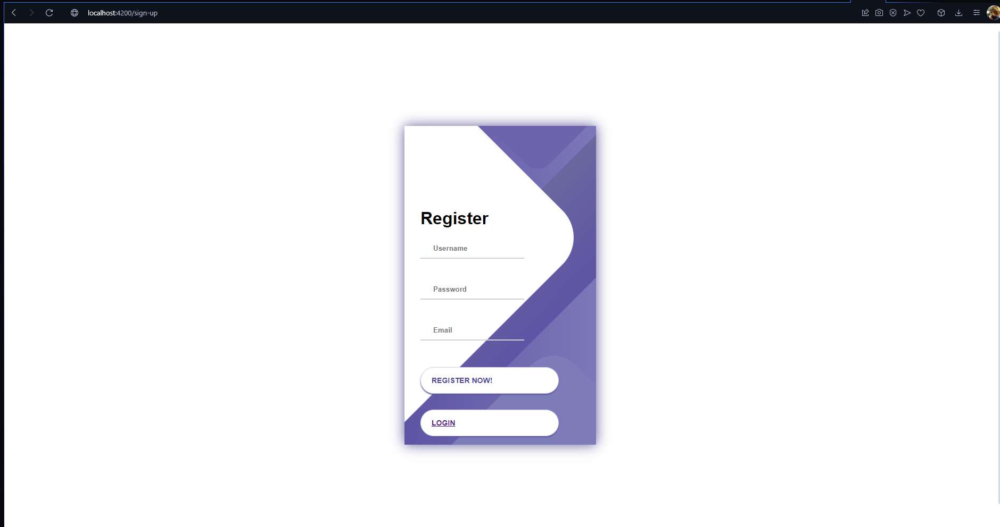

## Developer Notes
**2024/02/19** 

Hello Ryan here! This was my second time working with GraphQL and it was alot to learn. Will definantly revisit this project and make imporvments for learning/ experience purposes. 

Unfortunatly I wasn't able to implement the signup and login features, but I was able to implement all GraphQL API calls and store them into my mongoDB database! Here is an example of my generating a User & having their password censored for security purposes
 

**Create User**

 

**Display All Users**

 

I was also able to connect my mongoDb cluster and create models/schemas for the respective JSON data to be transfered into collections.

I was able to make a front-end component form page for login, signup and a dashboard that was able to display all users using the getUsers() function from my angular project (Assignment1)

